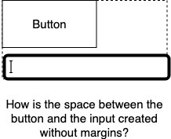

# Space

The difference between pixel perfect and good enough mostly boils down to whitespace management. Here we discuss the `Space` thought pattern developed in GLS.

## External Space

* Fundamental rule: Don't camp on external space. 
* Fundamental rule in CSS terms: Components should not have external margins.

### Issues with external margins

- Fundamentally external e.g. outside the width of the component in the recommended `border-box` box sizing:

- Collapses. You set a value, but it renders as something else depending on the neighbours. A maintainability nightmare.

- Makes pixel-perfect placement impossible. Margins on components disable pixel-perfect placement as they push themselves away from borders.

- Pollutes layout with logic. Suppose you want to conditionally render some buttons. If you are using component margins for spacing then there a conditional logic dependency leaking into your CSS. These dependencies quickly become unmanagable.

So the question: If the components are coming without margins, how are they being spaced from their neighbours e.g. how is the margin-free label and the input spaced? 

Lets discuss that next.

## How to do space correctly

Realize that a component's external space, is its parent's internal space. A parent is free to manage its internal space anyway it wants. So really space management between components is the responsibility of the container (and we provide plenty of such containers).

- Parent `spacing` prop can space children with pure CSS margins.

Remember good components don't come with bleedy margins. Since components don't use margins, our containers can easily create spacing between their children by adding margins with pure CSS (pseudocode: `CSS-selector(all children except last-child): CSS-property(margin)`).

Lets look at some examples of components. First a simple component e.g. an input:

Because the input was margin free, it can easily reuseable in any given context. It can easily be composed into a `label+input` set:

Once again the set we've created is external margin free, allowing us to create a composite of composites e.g. 3 x label+input

Notice that this composite of composites is also external margin free, and we can continue down this path of reuse.

- Padding for border whitespace.

Continuing on the three input form, we can easily wrap it in a padding.

## Code example with gls components

Here is a nice behaving demo input component we showed previously: 

`<DemoInput label="Name"/>`

Using our vertical layout we can stack them to create a composite input quite nicely:

`<DemoInput label="First Name"/> middle last`

Similarly here is a nice demo button with no bleedy margins:

`Submit`

And two of these in a nice horizontal composite component: 

`    Verify Submit` 

And then we can even stack two forms in another vertical layout seemlessly: 

`<DemoInput label="First Name"/> middle last , cancel submit`
