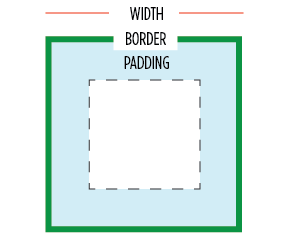
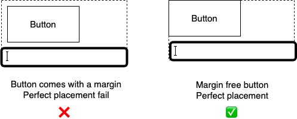
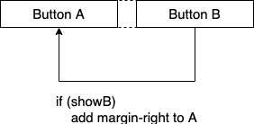
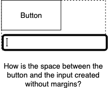

import { Playground } from 'docz';
import { Vertical } from '../..'; 
import * as demos from '../../demos'; 

# Space

The difference between pixel perfect and good enough mostly boils down to perfect space management. Here we discuss the *spacing principle* developed in GLS.

## Spacing principle

* Fundamental rule: Don't camp on external space. 
* Fundamental rule in CSS terms: Components should not have external margins.

### Issues with external margins

- Fundamentally external e.g. outside the width of the component in the recommended `border-box` box sizing:

- Collapses. You set a value, but it renders as something else depending on the neighbours. A maintainability nightmare.

- Makes pixel-perfect placement impossible. Margins on components disable pixel-perfect placement as they push themselves away from borders.

- Pollutes layout with logic. Suppose you want to conditionally render some buttons. If you are using component margins for spacing then there a conditional logic dependency leaking into your CSS. These dependencies quickly become unmanagable.

So the question: If the components are coming without margins, how are they being spaced from their neighbours e.g. how is the margin-free label and the input spaced? 

Lets discuss that next.

## How to do space correctly

Realize that a component's external space, is its parent's internal space. A parent is free to manage its internal space anyway it wants. So really space management between components is the responsibility of the container (and we provide plenty of such containers).

### Space among children: `spacing` prop
Remember good components don't come with bleedy margins. Since components don't use margins, our containers can easily create spacing between their children by adding margins with pure CSS (pseudocode: `CSS-selector(all children except last-child): CSS-property(margin)`).

Lets look at some examples of external-margin-free components and how they nicely compose. First a simple margin-free component e.g. an input:

<Playground>
  <demos.Input/>
</Playground>

Because the input was margin free, it can easily reuseable in any given context. It can easily be composed with a`label` to create a `label+input` set:

<Playground>
  <Vertical spacing={5}>
    <demos.Label>Name</demos.Label>
    <demos.Input/>
  </Vertical>
</Playground>

In the above example, notice
- the spacing is coming from the parent `Vertical spacing=5`. So our `input` and `label` don't have to fight each other to see whose margin wins.
- the vertical itself has no external margins. So the `Vertical(input+label)` set is once again resuseable.

We can easily compose multiple `Vertical(input+label)` into another `Vertical`, demonstrating creating a composite of composites e.g. 3 x label+input:

<Playground>
  <Vertical spacing={15}>
    <Vertical spacing={5}>
      <demos.Label>First name</demos.Label>
      <demos.Input/>
    </Vertical>
    <Vertical spacing={5}>
      <demos.Label>Middle name</demos.Label>
      <demos.Input/>
    </Vertical>
    <Vertical spacing={5}>
      <demos.Label>Last name</demos.Label>
      <demos.Input/>
    </Vertical>
  </Vertical>
</Playground>

Notice that this composite of composites (`Vertical( 3 x Vertical(label+input) )`) is also external margin free, and we can continue down this path of reuse. We'll stop here, but feel free to play with the provided examples.

### Space at the border: `padding` prop
We've talked about spacing children among each other, one final thing to talk about is how to seperate children from the parent border. The answer is to simply use padding: 

<Playground>
  <Vertical spacing={15} padding={15}>
    <Vertical spacing={5}>
      <demos.Label>First name</demos.Label>
      <demos.Input/>
    </Vertical>
    <Vertical spacing={5}>
      <demos.Label>Middle name</demos.Label>
      <demos.Input/>
    </Vertical>
    <Vertical spacing={5}>
      <demos.Label>Last name</demos.Label>
      <demos.Input/>
    </Vertical>
  </Vertical>
</Playground>

> Component design tip: `padding` can be used in any components that have an explict border (e.g buttons, user profile cards).

You normally:
* don't put `padding` on any *layout* components that you want to *compose* into other layouts.
* put `padding` on *page level* layout components.

So a page level form layout component would have padding, whereas a reusable form component would not. You can observe this pattern in the example below where the `Vertical`s for the reuseable `First/Middle/Last` name component does not have a padding (enabling seemless reuse): 

<Playground>
  {/* Not meant to be nested further */}
  <Vertical spacing={15} padding={15}>
    
    { /* User A: Reusable child */ }
    <Vertical spacing={15}>
      <Vertical spacing={5}>
        <demos.Label>UserA first name</demos.Label>
        <demos.Input/>
      </Vertical>
      <Vertical spacing={5}>
        <demos.Label>UserA middle name</demos.Label>
        <demos.Input/>
      </Vertical>
      <Vertical spacing={5}>
        <demos.Label>UserA last name</demos.Label>
        <demos.Input/>
      </Vertical>
    </Vertical>

    { /* User B: Reusing the same code as A, inline here, but you can componentify */ }
    <Vertical spacing={15}>
      <Vertical spacing={5}>
        <demos.Label>UserB first name</demos.Label>
        <demos.Input/>
      </Vertical>
      <Vertical spacing={5}>
        <demos.Label>UserB middle name</demos.Label>
        <demos.Input/>
      </Vertical>
      <Vertical spacing={5}>
        <demos.Label>UserB last name</demos.Label>
        <demos.Input/>
      </Vertical>
    </Vertical>

  </Vertical>
</Playground>